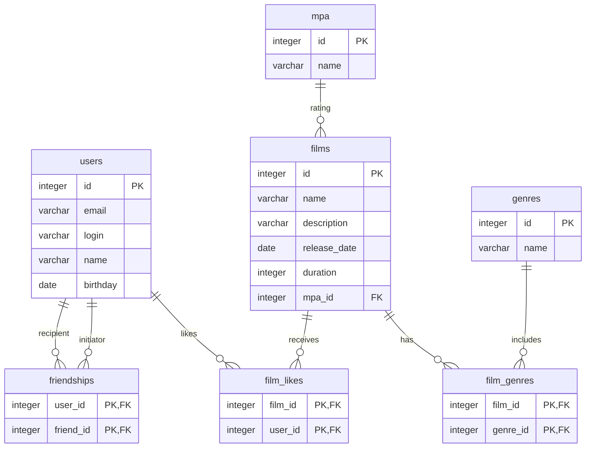

## Запуск

API доступен по адресу `http://localhost:8080`. Приложение сохраняет данные в
`./db/filmorate.mv.db`. При запуске из IntelliJ IDEA укажите корень проекта как
рабочую директорию, чтобы использовался тот же файл базы.

Настройки подключения находятся в `src/main/resources/application.properties`:
URL `jdbc:h2:file:./db/filmorate`, пользователь `sa`, пароль `password`.
Встроенная H2 открывает файл на время работы приложения. Для подключения к файлу
из внешнего клиента остановите приложение.

`schema.sql` создаёт отсутствующие таблицы, а `data.sql` заполняет справочники.
Повторная инициализация сохраняет пользовательские данные и не дублирует справочники.

## Структура базы данных



Составные первичные ключи исключают повторные лайки, жанры и заявки в друзья.
При удалении фильма или пользователя связанные записи удаляются каскадно.
Добавление и обновление фильма вместе с его жанрами выполняется в одной транзакции.

## API

| Метод и путь | Назначение |
| --- | --- |
| `POST /users`, `PUT /users` | Создание и обновление пользователя |
| `GET /users`, `GET /users/{id}` | Список пользователей и пользователь по id |
| `PUT /users/{id}/friends/{friendId}` | Добавление в друзья |
| `DELETE /users/{id}/friends/{friendId}` | Удаление из своего списка друзей |
| `GET /users/{id}/friends` | Друзья пользователя |
| `GET /users/{id}/friends/common/{otherId}` | Общие друзья |
| `POST /films`, `PUT /films` | Создание и обновление фильма |
| `GET /films`, `GET /films/{id}` | Список фильмов и фильм по id |
| `PUT /films/{id}/like/{userId}` | Поставить лайк |
| `DELETE /films/{id}/like/{userId}` | Убрать лайк |
| `GET /films/popular?count=10` | Популярные фильмы |
| `GET /genres`, `GET /genres/{id}` | Список жанров и жанр по id |
| `GET /mpa`, `GET /mpa/{id}` | Список рейтингов и рейтинг по id |

Создание возвращает `201 Created`, остальные успешные операции — `200 OK`.
Некорректные поля дают `400 Bad Request`, отсутствующие сущности — `404 Not Found`.

Пример тела `POST /films`:

```json
{
  "name": "Новый фильм",
  "description": "Описание фильма",
  "releaseDate": "2000-01-01",
  "duration": 120,
  "mpa": { "id": 3 },
  "genres": [{ "id": 2 }, { "id": 1 }]
}
```

Для `PUT /films` дополнительно передайте `id` фильма. Рейтинг обязателен.
Жанры можно не передавать; отсутствующий список, `null` и `[]` означают отсутствие
жанров, в том числе при обновлении. В ответе рейтинг и жанры содержат `id` и `name`.
Жанры возвращаются без повторов по возрастанию id; имена берутся из справочника.

Используется американская система MPAA:

| id | Рейтинг |
| --- | --- |
| 1 | G |
| 2 | PG |
| 3 | PG-13 |
| 4 | R |
| 5 | NC-17 |

Справочник жанров:

| id | Жанр |
| --- | --- |
| 1 | Комедия |
| 2 | Драма |
| 3 | Мультфильм |
| 4 | Триллер |
| 5 | Документальный |
| 6 | Боевик |

Популярность определяется числом
уникальных лайков; при равенстве фильмы упорядочены по id. По умолчанию `count=10`,
ноль возвращает пустой список, отрицательное значение даёт `400`.

Дружба односторонняя: запрос от A к B добавляет B только в список A. Подтверждение
происходит ответным запросом от B к A; тогда оба пользователя видят друг друга в
своих списках. Удаление A → B сохраняет связь B → A. Повторные запросы добавления
и удаления дружбы или лайков безопасны.